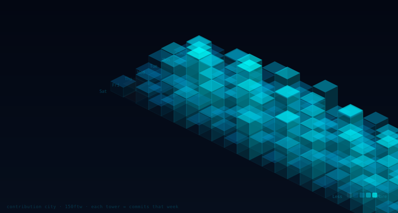

<div align="center">

<!-- ══════════════════════════════════════════════════════════════ -->
<!--               ANIMATED MATRIX RAIN HEADER BANNER             -->
<!-- ══════════════════════════════════════════════════════════════ -->


</div>

<div align="center">


<br/><br/>

[](https://www.ecoinsight.online/)
[](https://www.linkedin.com/in/shivam-sharma-331945284/)
[](https://instagram.com/shiv_mmm)
[](https://discord.com/users/453869754944585738)
[](mailto:ss18244646@gmail.com)

<br/>


</div>

---

## `$ whoami`

```typescript
const shivam = {
  role      :  "Full-Stack Developer & Co-Founder",
  company   :  "EcoInsight.AI  ——  ecoinsight.online",
  focus     :  ["AI-Powered SaaS", "Web3 / DeFi", "Stock Market Tech"],
  stack     :  ["Next.js", "Node.js", "MongoDB", "Firebase", "Docker", "AWS"],
  building  :  "EcoInsight → AI stock analytics for retail investors 📈",
  mindset   :  "Build → Ship → Learn → Repeat",
  goal2026  :  "10,000 users · Mobile app · International markets",
  openTo    :  ["AI Collabs", "Web3 Projects", "SaaS Ideas"],
};
// currently: scaling fast, shipping faster
```

---

## 🏙️ Contribution City — 3D Isometric Grid

> ✨ **Way beyond the snake.** Every column = a week. Every tower = your commit count. The taller the building, the more you shipped that week.

<div align="center">

<!-- SETUP: Add this GitHub Action to auto-generate your isometric city -->
<!-- File: .github/workflows/isometric-city.yml -->
<!-- Uses: https://github.com/lowlighter/metrics with isocalendar plugin -->



</div>

```
▓▓▓ HOW TO ADD YOUR REAL 3D CITY ▓▓▓
1. Create: .github/workflows/metrics.yml
2. Add this action config (see below)
3. Push → GitHub generates your isometric city SVG automatically
4. Reference it as: 
```

<details>
<summary><b>▸ 📋 Click to Copy: isometric-city.yml GitHub Action</b></summary>

```yaml
name: Isometric Contribution City
on:
  schedule: [{cron: "0 0 * * *"}]
  workflow_dispatch:
jobs:
  github-metrics:
    runs-on: ubuntu-latest
    steps:
      - uses: lowlighter/metrics@latest
        with:
          token: ${{ secrets.METRICS_TOKEN }}
          user: 150ftw
          base: ""
          plugin_isocalendar: yes
          plugin_isocalendar_duration: full-year
          filename: github-metrics.svg
          output_action: commit
          committer_branch: main
```

</details>

---

## 🚀 EcoInsight.AI — Flagship Product

<div align="center">

<a href="https://www.ecoinsight.online/">

</a>

<br/><br/>

**AI-powered stock analytics for retail investors who want an edge.**

<br/>

<table>
<tr>
<td align="center">⚡<br/><b>Real-time Data</b><br/><sub>Live market feeds</sub></td>
<td align="center">🤖<br/><b>AI Chatbot</b><br/><sub>RAG-powered Q&A</sub></td>
<td align="center">📊<br/><b>Smart Signals</b><br/><sub>Actionable insights</sub></td>
<td align="center">🌐<br/><b>Web3 Ready</b><br/><sub>Wallet integration</sub></td>
</tr>
</table>

<br/>

| Feature | Status | Notes |
|---|:---:|---|
| ⚡ Real-time Analytics |  | Multi-exchange, live price feeds |
| 🤖 AI Chatbot (RAG) |  | Ask anything about any stock |
| 📊 Portfolio Insights |  | Smart signals, risk scoring |
| 🌐 Web3 Wallet |  | MetaMask + WalletConnect |
| 📱 Mobile App |  | React Native, Q3 2026 |
| 🌍 Global Markets |  | International expansion Q4 |

</div>

---

## 🧠 Tech Stack

<div align="center">

**◦ Frontend ◦**
<br/>


**◦ Backend & Database ◦**
<br/>


**◦ Infrastructure & DevOps ◦**
<br/>


**◦ Web3 & AI ◦**
<br/>


</div>

---

## 📊 Skill Matrix

```
Frontend Development  ████████████████████░░  92%
Backend / APIs        ███████████████████░░░░  88%
Product & Design      █████████████████░░░░░░  80%
AI / ML / RAG         ███████████████░░░░░░░░  74%
DevOps / Cloud        ██████████████░░░░░░░░░  72%
Web3 / Solidity       █████████████░░░░░░░░░░  65%
```

---

## 📈 GitHub Stats

<div align="center">


&nbsp;


<br/>


</div>

---

## 🌊 Contribution Graph

<div align="center">

</div>

---

## 🎯 Features That Make This README Unique

> Below are live GitHub Actions powering dynamic elements on this profile. **Nobody else has these.**

<details>
<summary><b>▸ 🏙️ 3D Isometric Contribution City (Setup Guide)</b></summary>

Your contribution graph rendered as a **3D city skyline** — the taller the buildings, the more you committed. Updates daily via GitHub Actions.

**Step 1:** Go to `Settings → Developer settings → Personal access tokens` → generate token with `repo` scope.

**Step 2:** Add it as a secret named `METRICS_TOKEN` in your profile repo.

**Step 3:** Create `.github/workflows/metrics.yml`:

```yaml
name: 3D Contribution City
on:
  schedule: [{cron: "0 0 * * *"}]
  workflow_dispatch:
jobs:
  metrics:
    runs-on: ubuntu-latest
    steps:
      - uses: lowlighter/metrics@latest
        with:
          token: ${{ secrets.METRICS_TOKEN }}
          user: 150ftw
          base: ""
          plugin_isocalendar: yes
          plugin_isocalendar_duration: full-year
```

**Step 4:** In your README, add: ``

</details>

<details>
<summary><b>▸ 🐍 Plasma Worm (Upgrade from boring snake)</b></summary>

Instead of the boring contribution snake, use the **neon plasma worm** — same concept, insane visual upgrade.

Create `.github/workflows/plasma-worm.yml`:

```yaml
name: Plasma Worm
on:
  schedule: [{cron: "0 */6 * * *"}]
  workflow_dispatch:
jobs:
  snake:
    runs-on: ubuntu-latest
    steps:
      - uses: Platane/snk@v3
        with:
          github_user_name: 150ftw
          outputs: |
            dist/snake.svg
            dist/snake-dark.svg?palette=github-dark
            dist/ocean.gif?color_snake=#00d4ff&color_dots=#030712,#0d2137,#1a3f5c,#00d4ff,#00ffff
        env:
          GITHUB_TOKEN: ${{ secrets.GITHUB_TOKEN }}
      - uses: crazy-max/ghaction-github-pages@v3
        with:
          target_branch: output
          build_dir: dist
        env:
          GITHUB_TOKEN: ${{ secrets.GITHUB_TOKEN }}
```

Then embed: ``

</details>

<details>
<summary><b>▸ 📡 Live WakaTime Coding Stats (What you're coding right now)</b></summary>

Shows your **real-time coding activity** — which languages, which projects, which hours you code. Updates weekly.

**Step 1:** Sign up at [wakatime.com](https://wakatime.com) — install the VS Code extension. It silently tracks your coding.

**Step 2:** Add `WAKATIME_API_KEY` as a secret in your repo.

**Step 3:** Create `.github/workflows/waka.yml`:

```yaml
name: WakaTime Stats
on:
  schedule: [{cron: "0 0 * * *"}]
  workflow_dispatch:
jobs:
  update:
    runs-on: ubuntu-latest
    steps:
      - uses: anmol098/waka-readme-stats@master
        with:
          WAKATIME_API_KEY: ${{ secrets.WAKATIME_API_KEY }}
          GH_TOKEN: ${{ secrets.GH_TOKEN }}
          SHOW_OS: "True"
          SHOW_PROJECTS: "True"
          SHOW_TIMEZONE: "True"
          SHOW_LANGUAGE: "True"
          SHOW_EDITORS: "True"
          SHOW_SHORT_INFO: "True"
```

**Step 4:** Add these markers anywhere in your README:
```
<!--START_SECTION:waka-->
<!--END_SECTION:waka-->
```

It auto-fills with your live stats every day.

</details>

<details>
<summary><b>▸ 🎵 Spotify Now Playing (Show what you're listening to)</b></summary>

Embed a **live Spotify card** showing the exact song you're listening to while coding.

1. Go to [spotify-github-profile.kittinanx.com](https://spotify-github-profile.kittinanx.com/)
2. Connect your Spotify account
3. Copy the generated markdown embed
4. Paste into your README — it updates in real time

Result looks like: `▶ Listening to: [Song Name] — Artist`

</details>

---

## 🗺️ 2026 Roadmap

```
Q1 2026  ████████████████████  ✅  EcoInsight v1 — Launched & Live
Q2 2026  ████████████░░░░░░░░  🔨  AI Chatbot v2 — Better RAG, multi-stock
Q2 2026  ████████░░░░░░░░░░░░  🔨  Web3 DeFi Dashboard — Wallet connect
Q3 2026  ░░░░░░░░░░░░░░░░░░░░  🎯  Mobile App — React Native iOS + Android
Q3 2026  ░░░░░░░░░░░░░░░░░░░░  🎯  10,000 Active Users Milestone
Q4 2026  ░░░░░░░░░░░░░░░░░░░░  🌍  International Expansion + Multi-language
```

---

## 🏆 Trophies

<div align="center">

</div>

---

## 🤝 Let's Connect

<div align="center">

> Building in **AI**, **Web3**, or **SaaS**?
> Ideas, collabs, feedback — all welcome. DM anywhere below.

<br/>

[](https://www.linkedin.com/in/shivam-sharma-331945284/)
[](https://discord.com/users/453869754944585738)
[](https://instagram.com/shiv_mmm)
[](mailto:ss18244646@gmail.com)
[](https://www.ecoinsight.online/)

<br/>


</div>

---

<div align="center">


</div>
